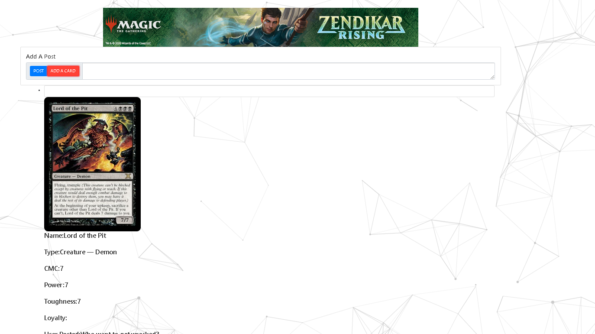
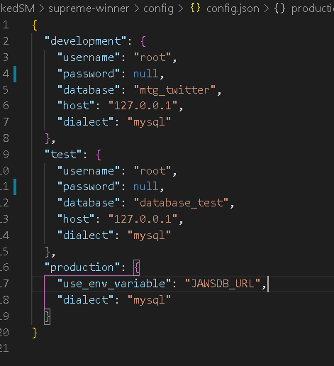

# Magic The Gabbering
This is a twitter/Facebook like app that allows users to searcht he Magic The Gabbering Api for thier favorite cards.  Once loaded they can add a post where other users can respond. In addition to posting cards feature some of the specs MTG fans love. The site is mostly unauthenticated so one can have fun when adding thier names to a comment. The Link is hoseted on Heroku and can be sample <a href ="https://sheltered-tor-50073.herokuapp.com/members"> here. </a>

## Installation

The package requires Node.js, MySql, Express server, Sequelize, Handlebars and Passport NPM packages. It also requires Bootstrap and jQuery for the front end code. Clone the repo, run npm i and this should install all the dependencies. The /config/config.json file will require a password for your MySql server

Be sure to change the password field to your MySql Password. This is a must if you want to run the application.

Be sure to also load the schema, in your project folder type mysql 

-u username -p

Once logged in use:

source schema.sql

#Credits
Thanks to Dakota, Jeremy and Linzy as they also contributed to this project.